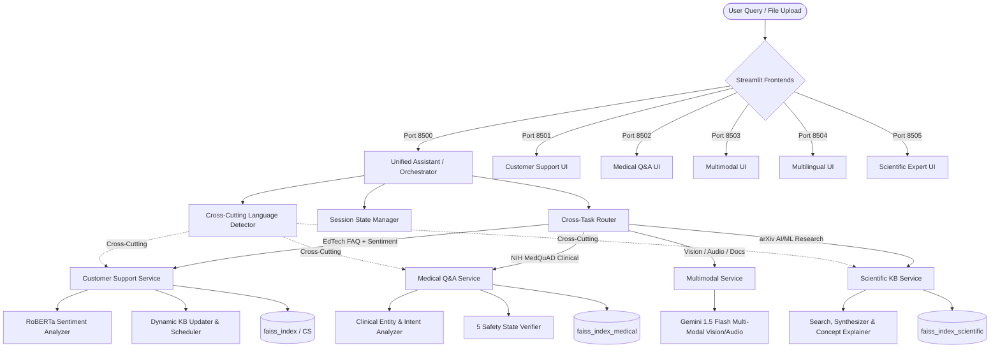

# ElevanceSkills GenAI Internship — Multi-Domain AI Platform

[](https://www.python.org/)
[](https://streamlit.io/)
[](https://huggingface.co/)
[](https://github.com/facebookresearch/faiss)
[](https://ai.google.dev/)

A multi-domain, production-grade Generative AI and Retrieval-Augmented Generation (RAG) assistant platform developed during the **ElevanceSkills Generative AI Internship**. 

The system evolves a single-domain customer support baseline into a decoupled, unified intelligence ecosystem spanning customer support with sentiment conditioning, dynamic knowledge base management, NIH MedQuAD clinical Q&A with strict safety boundaries, arXiv AI/ML scientific domain expertise, multimodal document/image/audio intelligence, and cross-cutting multilingual capabilities.

---

## 📋 Table of Contents

1. [Internship Context & Evolution](#-internship-context--evolution)
2. [Architecture Overview](#-architecture-overview)
3. [The Six Internship Tasks](#-the-six-internship-tasks)
   - [Task 1: Sentiment Analysis](#task-1--sentiment-analysis)
   - [Task 2: Medical Q&A Assistant (MedQuAD)](#task-2--medical-qa-assistant-medquad)
   - [Task 3: Dynamic Knowledge Base](#task-3--dynamic-knowledge-base)
   - [Task 4: Scientific Domain Expert (arXiv AI/ML)](#task-4--scientific-domain-expert-arxiv-aiml)
   - [Task 5: Multimodal AI Assistant](#task-5--multimodal-ai-assistant)
   - [Task 6: Multilingual Chatbot](#task-6--multilingual-chatbot)
4. [Cross-Task Integration & Routing](#-cross-task-integration--routing)
5. [User Interfaces & Port Allocation](#-user-interfaces--port-allocation)
6. [Datasets & Protected Production Assets](#-datasets--protected-production-assets)
7. [Installation & Setup](#-installation--setup)
8. [Running the Applications](#-running-the-applications)
9. [Testing & Quality Assurance](#-testing--quality-assurance)
10. [Static Analysis & Code Quality](#-static-analysis--code-quality)
11. [Known Limitations & Baseline Discrepancies](#-known-limitations--baseline-discrepancies)
12. [Repository Directory Structure](#-repository-directory-structure)

---

## 🏛️ Internship Context & Evolution

This repository traces the systematic engineering progression of the **ElevanceSkills Generative AI Internship**:

1. **Initial Baseline**: Began with a simple LangChain + Google PaLM customer service prototype for an e-learning organization (Nullclass FAQ dataset), as preserved in [`README.training.md`](file:///E:/Project%20Folder/NLP-chatbot-files/ElevanceSkills-GenAI-Internship/README.training.md).
2. **Domain Decoupling & Modernization**: Upgraded the foundation to Google Gemini, implemented HuggingFace sentence embeddings (`all-MiniLM-L6-v2`), and structured services into modular components under `src/`.
3. **Specialized Intelligence Tasks**: Sequentially implemented and validated sentiment-aware response conditioning, clinical RAG with NIH MedQuAD, live dynamic knowledge base sync, scientific paper analysis over 100 arXiv AI/ML publications, multi-format multimodal processing, and cross-lingual routing.
4. **Unified Orchestration**: Constructed a non-invasive cross-task routing layer (`src/cross_task/`) providing an intelligent unified interface while preserving all standalone applications and protected vector assets.

---

## 🏗️ Architecture Overview

The system is structured as an extensible micro-architecture with clear domain boundaries:



---

## 🔬 The Six Internship Tasks

### Task 1 — Sentiment Analysis
- **Implementation**: [`src/sentiment_analyzer.py`](file:///E:/Project%20Folder/NLP-chatbot-files/ElevanceSkills-GenAI-Internship/src/sentiment_analyzer.py) and [`src/response_policy.py`](file:///E:/Project%20Folder/NLP-chatbot-files/ElevanceSkills-GenAI-Internship/src/response_policy.py).
- **Core Technology**: CardiffNLP RoBERTa model (`cardiffnlp/twitter-roberta-base-sentiment-latest`) with robust rule/lexicon-based fallback when transformer models are offline.
- **Architectural Role**: Operates as a behavioral response conditioning filter inside Customer Support rather than a distinct conversational domain.
- **Behavior**:
  - `NEGATIVE`: Prefixes an empathetic apology and customer-first validation before delivering the FAQ answer.
  - `POSITIVE`: Appends an encouraging appreciation closing note.
  - `NEUTRAL`: Delivers clean, unadorned FAQ responses.

### Task 2 — Medical Q&A Assistant (MedQuAD)
- **Implementation**: [`src/medical_qa_service.py`](file:///E:/Project%20Folder/NLP-chatbot-files/ElevanceSkills-GenAI-Internship/src/medical_qa_service.py), [`src/medquad_retriever.py`](file:///E:/Project%20Folder/NLP-chatbot-files/ElevanceSkills-GenAI-Internship/src/medquad_retriever.py), [`src/medquad_query_analyzer.py`](file:///E:/Project%20Folder/NLP-chatbot-files/ElevanceSkills-GenAI-Internship/src/medquad_query_analyzer.py).
- **Core Technology**: 12 NIH collections parsed from XML, indexed using HuggingFace sentence transformers into isolated vector store `faiss_index_medical/`.
- **Safety States**: Every medical query is classified into one of five rigorous states:
  1. `GROUNDED`: Evidence similarity $\ge 0.50$ with recognized clinical entities. Generates grounded answer with confidence tier and NIH citations.
  2. `INSUFFICIENT_EVIDENCE`: Medical intent present but retrieval similarity $< 0.50$. Bypasses LLM; issues clinical safety disclaimer.
  3. `OUT_OF_DOMAIN`: Non-medical intent detected. Bypasses LLM; issues domain boundary guidance.
  4. `RETRIEVAL_ERROR`: Vector index lookup failure. Bypasses LLM; safely logs without leaking stack traces.
  5. `GENERATION_ERROR`: LLM failure despite valid evidence. Provides safe fallback while retaining retrieved reference data.
- **Documentation**: Detailed guide in [`docs/MEDICAL_QA_GUIDE.md`](file:///E:/Project%20Folder/NLP-chatbot-files/ElevanceSkills-GenAI-Internship/docs/MEDICAL_QA_GUIDE.md).

### Task 3 — Dynamic Knowledge Base
- **Implementation**: [`src/knowledge_base/`](file:///E:/Project%20Folder/NLP-chatbot-files/ElevanceSkills-GenAI-Internship/src/knowledge_base/) (`kb_updater.py`, `scheduler.py`, `validator.py`, `atomic_writer.py`).
- **Capabilities**:
  - Thread-safe, atomic updates to [`dataset/knowledge_base.csv`](file:///E:/Project%20Folder/NLP-chatbot-files/ElevanceSkills-GenAI-Internship/dataset/knowledge_base.csv) with schema validation and deduplication.
  - Background synchronization via `KBUpdateScheduler` for zero-downtime knowledge base reloads.
  - Dedicated admin sync console embedded in [`src/main.py`](file:///E:/Project%20Folder/NLP-chatbot-files/ElevanceSkills-GenAI-Internship/src/main.py) for manual or automated FAQ refreshes.

### Task 4 — Scientific Domain Expert (arXiv AI/ML)
- **Implementation**: [`src/scientific_kb/`](file:///E:/Project%20Folder/NLP-chatbot-files/ElevanceSkills-GenAI-Internship/src/scientific_kb/) (`service.py`, `retriever.py`, `synthesizer.py`, `query_classifier.py`, `concept_explainer.py`).
- **Core Technology**: 100 AI/ML research papers from arXiv indexed into `faiss_index_scientific/`.
- **Key Capabilities**:
  - Paper semantic search and metadata extraction (titles, authors, categories, publication dates).
  - Multi-paper comparative analysis and thematic synthesis.
  - Multi-level concept explanations (Beginner, Intermediate, Expert/Mathematical).
  - Automatic query classification: `SEARCH`, `SUMMARIZATION`, `CONCEPT_EXPLANATION`, `COMPARISON`.

### Task 5 — Multimodal AI Assistant
- **Implementation**: [`src/multimodal/`](file:///E:/Project%20Folder/NLP-chatbot-files/ElevanceSkills-GenAI-Internship/src/multimodal/) (`service.py`, `file_processor.py`, `prompt_templates.py`).
- **Supported Media**:
  - **Images**: PNG, JPG, JPEG, WEBP (analyzed via Gemini 1.5 Flash Vision).
  - **Audio**: WAV, MP3 (transcribed and analyzed via Gemini audio capabilities).
  - **Documents**: PDF, TXT, DOCX (text extracted, chunked, and contextualized).
- **Safety & Limits**: Enforces 20MB file size limit, strict MIME type validation, temporary file cleanup, and defensive fallback error handling.

### Task 6 — Multilingual Chatbot
- **Implementation**: [`src/multilingual/`](file:///E:/Project%20Folder/NLP-chatbot-files/ElevanceSkills-GenAI-Internship/src/multilingual/) (`service.py`, `language_detector.py`, `prompts.py`).
- **Languages Supported**: English (`en`), Spanish (`es`), French (`fr`), German (`de`), Hindi (`hi`).
- **Cross-Cutting Role**:
  - Functions as an orthogonal platform capability rather than a standalone domain.
  - Performs non-English detection and translation for Customer Support.
  - Normalizes non-English queries into English for retrieval against English vector databases (MedQuAD and arXiv), ensuring domain evidence is accurately retrieved before returning localized responses with detected language metadata.

---

## 🔄 Cross-Task Integration & Routing

The unified layer in [`src/cross_task/`](file:///E:/Project%20Folder/NLP-chatbot-files/ElevanceSkills-GenAI-Internship/src/cross_task/) brings all subsystems together:

- **`TaskRouter`** ([`router.py`](file:///E:/Project%20Folder/NLP-chatbot-files/ElevanceSkills-GenAI-Internship/src/cross_task/router.py)):
  - Analyzes queries using priority keywords, regex patterns, and domain markers.
  - Routes to `CUSTOMER_SUPPORT`, `MEDICAL_QA`, `SCIENTIFIC_RESEARCH`, or `MULTIMODAL`.
  - Supports explicit UI domain overrides or fully automatic intent routing.
- **`UnifiedOrchestrator`** ([`orchestrator.py`](file:///E:/Project%20Folder/NLP-chatbot-files/ElevanceSkills-GenAI-Internship/src/cross_task/orchestrator.py)):
  - Coordinates domain dispatching, query normalization, and response aggregation.
  - Tracks execution latency, confidence scores, and cross-cutting language detection.
- **`SessionManager`** ([`session_manager.py`](file:///E:/Project%20Folder/NLP-chatbot-files/ElevanceSkills-GenAI-Internship/src/cross_task/session_manager.py)):
  - Maintains conversation history across domain switches without data contamination.
  - Provides thread-safe session resets and message export.

---

## 🖥️ User Interfaces & Port Allocation

Each application can run standalone or through the unified portal. In accordance with platform standards, each Streamlit UI runs on its designated port:

| Interface | Script Path | Default Port | Description |
| :--- | :--- | :--- | :--- |
| **Unified AI Assistant** | [`src/unified_main.py`](file:///E:/Project%20Folder/NLP-chatbot-files/ElevanceSkills-GenAI-Internship/src/unified_main.py) | **`8500`** | Central portal orchestrating all domains with auto/manual routing |
| **Customer Support UI** | [`src/main.py`](file:///E:/Project%20Folder/NLP-chatbot-files/ElevanceSkills-GenAI-Internship/src/main.py) | **`8501`** | EdTech FAQ bot with Task 1 Sentiment + Task 3 Dynamic KB sync |
| **Medical Q&A UI** | [`src/medical_main.py`](file:///E:/Project%20Folder/NLP-chatbot-files/ElevanceSkills-GenAI-Internship/src/medical_main.py) | **`8502`** | MedQuAD clinical Q&A with 5 safety states & NIH source badges |
| **Multimodal UI** | [`src/multimodal_main.py`](file:///E:/Project%20Folder/NLP-chatbot-files/ElevanceSkills-GenAI-Internship/src/multimodal_main.py) | **`8503`** | Image, audio, and document analysis assistant |
| **Multilingual UI** | [`src/multilingual_main.py`](file:///E:/Project%20Folder/NLP-chatbot-files/ElevanceSkills-GenAI-Internship/src/multilingual_main.py) | **`8504`** | Standalone 5-language conversational bot |
| **Scientific Research UI** | [`src/scientific_main.py`](file:///E:/Project%20Folder/NLP-chatbot-files/ElevanceSkills-GenAI-Internship/src/scientific_main.py) | **`8505`** | arXiv AI/ML research paper search, explanation & synthesis |

---

## 💾 Datasets & Protected Production Assets

> [!IMPORTANT]
> **Production Asset Protection Policy**: The datasets and persisted vector indexes below are immutable baseline assets. They must **never** be deleted, overwritten, or automatically re-indexed during routine execution or testing.

- **Customer Support Dataset**: [`dataset/knowledge_base.csv`](file:///E:/Project%20Folder/NLP-chatbot-files/ElevanceSkills-GenAI-Internship/dataset/knowledge_base.csv) (79 records).
- **Scientific Research Dataset**: [`dataset/arxiv_ai_ml_subset.jsonl`](file:///E:/Project%20Folder/NLP-chatbot-files/ElevanceSkills-GenAI-Internship/dataset/arxiv_ai_ml_subset.jsonl) (100 research papers).
- **Customer FAISS Index**: `faiss_index/` (Contains 76 embedded vectors matching baseline training state).
- **Medical FAISS Index**: `faiss_index_medical/` (Contains 5 curated MedQuAD vectors with metadata).
- **Scientific FAISS Index**: `faiss_index_scientific/` (Contains 100 embedded arXiv research papers).

---

## ⚙️ Installation & Setup

### Prerequisites
- Python `3.11` (x64 recommended)
- Git

### 1. Clone the Repository
```bash
git clone https://github.com/aslin72/customer_service_chatbot_LLM.git
cd customer_service_chatbot_LLM
```

### 2. Set Up Virtual Environment
```bash
# Windows
python -m venv chatbot
chatbot\Scripts\activate

# Linux / macOS
python3 -m venv chatbot
source chatbot/bin/activate
```

### 3. Install Dependencies
```bash
pip install -r requirements.txt
```

### 4. Configure Environment Variables
Create a `.env` file in the project root (see [`.env.example`](file:///E:/Project%20Folder/NLP-chatbot-files/ElevanceSkills-GenAI-Internship/.env.example)):
```env
GOOGLE_API_KEY="your_google_gemini_api_key_here"
```

---

## 🚀 Running the Applications

You can launch the Unified AI Assistant or any standalone application:

```bash
# 1. Launch the Unified Multi-Domain Assistant (Recommended)
streamlit run src/unified_main.py --server.port 8500

# 2. Launch Customer Support Chatbot (with Sentiment & Dynamic KB)
streamlit run src/main.py --server.port 8501

# 3. Launch Medical Q&A Assistant (MedQuAD)
streamlit run src/medical_main.py --server.port 8502

# 4. Launch Multimodal Assistant (Images / Audio / Documents)
streamlit run src/multimodal_main.py --server.port 8503

# 5. Launch Multilingual Chatbot (Standalone)
streamlit run src/multilingual_main.py --server.port 8504

# 6. Launch Scientific Research Assistant (arXiv)
streamlit run src/scientific_main.py --server.port 8505
```

---

## 🧪 Testing & Quality Assurance

The repository includes an extensive automated regression test suite covering all domains and cross-task integrations.

### Running the Full Test Suite
To run the full regression test suite with TensorFlow disabled and environment paths properly configured:

```bash
# Windows PowerShell
$env:PYTHONPATH="."; $env:TRANSFORMERS_NO_TF="1"; $env:USE_TF="0"; pytest

# Windows CMD
set PYTHONPATH=. && set TRANSFORMERS_NO_TF=1 && set USE_TF=0 && pytest

# Linux / macOS
PYTHONPATH=. TRANSFORMERS_NO_TF=1 USE_TF=0 pytest
```

### Running Specific Test Suites
```bash
# Run Cross-Task Integration test suites
pytest -k cross_task

# Run Medical Q&A test suites
pytest tests/test_medical_qa_service.py tests/test_medical_ui.py

# Run Multilingual test suites
pytest tests/test_multilingual_evaluation.py tests/test_multilingual_language_identification.py

# Run Multimodal test suites
pytest tests/test_multimodal_pipeline.py tests/test_multimodal_vision.py

# Run Scientific Research test suites
pytest tests/test_scientific_service.py tests/test_scientific_exploration.py
```

### Test Baseline Status
- **Total Discovered Tests**: 727 items across 48 test modules.
- **Passing**: **727/727 passing (100% pass rate)**.
- **Verification**: All 727 tests pass cleanly with zero failures and zero errors under the verified execution environment.

---

## 🔍 Static Analysis & Code Quality

Type checking and linting are configured via [`pyproject.toml`](file:///E:/Project%20Folder/NLP-chatbot-files/ElevanceSkills-GenAI-Internship/pyproject.toml) and [`pyrightconfig.json`](file:///E:/Project%20Folder/NLP-chatbot-files/ElevanceSkills-GenAI-Internship/pyrightconfig.json).

To run Pyright over the integration layer:
```bash
npx pyright src/cross_task src/unified_main.py
```
- **Result**: `0 errors, 0 warnings, 0 informations`.

---

## ⚠️ Architectural Context & Design Notes

1. **Customer Support Dataset & Index Alignment**: The Customer Support FAQ CSV (`dataset/knowledge_base.csv`) contains 79 entries (76 baseline entries + 3 dynamic updates), while the pre-built, protected baseline `faiss_index/` vector store contains 76 vectors. Isolation tests explicitly assert both invariants (79 CSV records, 76 baseline vectors) without destructive re-indexing.
2. **Medical/Scientific Multilingual Responses**: While Customer Support features direct target-language response generation, Medical and Scientific RAG systems normalize queries to English for retrieval accuracy against NIH and arXiv corpora and preserve clinical/scientific terminology in English while tagging the response with detected language metadata.
3. **Module Packaging**: `src/` contains [`src/__init__.py`](file:///E:/Project%20Folder/NLP-chatbot-files/ElevanceSkills-GenAI-Internship/src/__init__.py) as a package marker for consistent cross-module imports.

---

## 📁 Repository Directory Structure

```text
ElevanceSkills-GenAI-Internship/
├── dataset/                         # Protected production datasets
│   ├── knowledge_base.csv           # Customer Support FAQs (79 entries)
│   └── arxiv_ai_ml_subset.jsonl     # arXiv AI/ML research papers (100 papers)
├── docs/                            # Domain documentation
│   └── MEDICAL_QA_GUIDE.md          # NIH MedQuAD technical manual
├── faiss_index/                     # Protected Customer Support vector index (76 vectors)
├── faiss_index_medical/             # Protected MedQuAD medical vector index (5 vectors)
├── faiss_index_scientific/          # Protected arXiv scientific vector index (100 vectors)
├── src/                             # Application source code
│   ├── cross_task/                  # Unified cross-task routing & orchestration
│   │   ├── models.py                # Domain enums, request/response models
│   │   ├── router.py                # Intent routing & keyword classification
│   │   ├── orchestrator.py          # Central execution orchestrator
│   │   └── session_manager.py       # Multi-domain session state management
│   ├── knowledge_base/              # Dynamic KB management (Task 3)
│   │   ├── atomic_writer.py         # Thread-safe atomic file writing
│   │   ├── kb_updater.py            # Knowledge base sync service
│   │   ├── scheduler.py             # Periodic background sync scheduler
│   │   └── validator.py             # Schema & data integrity validation
│   ├── multilingual/                # Multilingual capability (Task 6)
│   │   ├── language_detector.py     # Script, ngram & stopword detection
│   │   ├── prompts.py               # Multilingual prompt templates
│   │   └── service.py               # Cross-lingual translation & query handling
│   ├── multimodal/                  # Multimodal processing (Task 5)
│   │   ├── file_processor.py        # MIME detection, text extraction & audio handling
│   │   ├── prompt_templates.py      # Vision & document prompts
│   │   └── service.py               # Gemini multimodal orchestration
│   ├── scientific_kb/               # Scientific domain expert (Task 4)
│   │   ├── concept_explainer.py     # Multi-level concept explainer
│   │   ├── query_classifier.py      # arXiv query intent classifier
│   │   ├── retriever.py             # Scientific FAISS retriever
│   │   ├── service.py               # End-to-end scientific service
│   │   └── synthesizer.py           # Multi-paper synthesis & comparison
│   ├── chatbot_service.py           # Customer Support RAG service
│   ├── langchain_helper.py          # Legacy LangChain FAISS initialization
│   ├── main.py                      # Customer Support UI (Port 8501)
│   ├── medical_main.py              # Medical Q&A UI (Port 8502)
│   ├── medical_qa_service.py        # MedQuAD clinical service & safety states (Task 2)
│   ├── medquad_indexer.py           # MedQuAD XML parsing & indexing pipeline
│   ├── medquad_parser.py            # MedQuAD XML schema parser
│   ├── medquad_query_analyzer.py    # Clinical entity & question intent analyzer
│   ├── medquad_retriever.py         # Medical vector retriever
│   ├── multimodal_main.py           # Multimodal Assistant UI (Port 8503)
│   ├── multilingual_main.py         # Multilingual Assistant UI (Port 8504)
│   ├── response_policy.py           # Sentiment-conditioned response policies (Task 1)
│   ├── scientific_main.py           # Scientific Research UI (Port 8505)
│   ├── sentiment_analyzer.py        # CardiffNLP RoBERTa sentiment classifier (Task 1)
│   └── unified_main.py              # Unified AI Assistant Portal (Port 8500)
├── tests/                           # Automated test suite (727 tests)
├── .env.example                     # Environment template
├── pyproject.toml                   # Pytest & Pyright configuration
├── pyrightconfig.json               # Pyright type checker settings
├── README.md                        # Production system documentation
├── README.training.md               # Original baseline training documentation
└── requirements.txt                 # Pinned dependencies
```

---

## 📜 License & Acknowledgments

- **Internship Program**: ElevanceSkills Generative AI Internship
- **Original Training Baseline**: Nullclass EdTech Q&A system
- **Open-Source Datasets**:
  - NIH MedQuAD (Medical Question Answering Dataset)
  - arXiv.org e-Print Archive (Computer Science AI/ML)
  - CardiffNLP Twitter RoBERTa Sentiment Model
