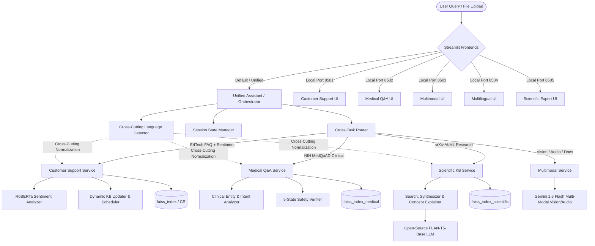

# Multi-Domain Generative AI & RAG Platform

[](https://www.python.org/)
[](https://streamlit.io/)
[](https://huggingface.co/BAAI/bge-small-en-v1.5)
[](https://github.com/facebookresearch/faiss)
[-4285F4.svg)](https://huggingface.co/google/flan-t5-base)
[](https://elevance-skills-genai-internship-zh33advtaph2cc5utfyiuu.streamlit.app/)

An enterprise-grade, multi-domain Generative AI and Retrieval-Augmented Generation (RAG) platform. The system unifies specialized domain intelligence across sentiment-conditioned customer support, live dynamic knowledge base management, NIH MedQuAD clinical Q&A with deterministic safety boundaries, arXiv AI/ML scientific paper exploration with local open-source FLAN-T5 synthesis, multimodal image/audio/document reasoning, and cross-cutting multilingual query translation into an integrated, decoupled architecture.

---

## 🚀 Live Demo

[Open the Live Streamlit Application](https://elevance-skills-genai-internship-zh33advtaph2cc5utfyiuu.streamlit.app/)

- **Target Platform**: Streamlit Community Cloud
- **Unified Entrypoint**: [`src/unified_main.py`](src/unified_main.py)
- **Status**: Live and interactive across all domains

---

## 📋 Table of Contents

1. [Key Features](#-key-features)
2. [Architecture Overview](#️-architecture-overview)
3. [Technology Stack](#-technology-stack)
4. [Core Domain Modules](#-core-domain-modules)
   - [Module 1: Sentiment-Conditioned Customer Support](#module-1--sentiment-conditioned-customer-support)
   - [Module 2: Medical Clinical Q&A (NIH MedQuAD)](#module-2--medical-clinical-qa-nih-medquad)
   - [Module 3: Dynamic Knowledge Base & Ingestion Pipeline](#module-3--dynamic-knowledge-base--ingestion-pipeline)
   - [Module 4: Scientific Domain Expert (arXiv AI/ML)](#module-4--scientific-domain-expert-arxiv-aiml)
   - [Module 5: Multimodal Intelligence (Vision, Audio, Docs)](#module-5--multimodal-intelligence-vision-audio-docs)
   - [Module 6: Cross-Cutting Multilingual Engine](#module-6--cross-cutting-multilingual-engine)
5. [Cross-Task Integration & Unified Routing](#-cross-task-integration--unified-routing)
6. [Protected Production Assets](#-protected-production-assets)
7. [Installation & Setup](#-installation--setup)
8. [Environment Variables](#-environment-variables)
9. [Running Locally](#-running-locally)
10. [Deployment](#-deployment)
11. [Testing & Quality Assurance](#-testing--quality-assurance)
12. [Known Limitations](#-known-limitations)
13. [Repository Directory Structure](#-repository-directory-structure)
14. [Dataset & Model Attributions](#-dataset--model-attributions)

---

## 🌟 Key Features

- **Decoupled Multi-Domain RAG**: Domain-isolated vector stores ensure clinical, scientific, and customer knowledge never cross-contaminate.
- **Sentiment-Conditioned Response Policies**: RoBERTa-driven behavioral conditioning adapts tone (empathetic apologies for frustrated queries, appreciative closures for positive queries) while preserving factual grounding.
- **Deterministic 5-State Clinical Safety Gate**: Strict boundary verification for medical inquiries, enforcing safety disclaimers and out-of-domain guidance without LLM hallucination.
- **Atomic Dynamic Knowledge Base Updates**: Schema-validated ingestion pipeline supporting scheduled updates and zero-downtime reloads.
- **Local Open-Source Scientific Synthesis**: arXiv AI/ML research assistant powered by local `google/flan-t5-base` CPU execution, operating completely independently of third-party API quotas.
- **Multimodal Perception**: Zero-leakage processing of images, audio recordings, and structured documents via Gemini 1.5 Flash.
- **Cross-Cutting Multilingual Normalization**: Transparent 5-language detection (EN, ES, FR, DE, HI) and English query normalization for accurate retrieval against English corpora.
- **Unified Orchestration**: Intelligent intent routing and session management through a single consolidated interface ([`src/unified_main.py`](src/unified_main.py)).

---

## 🏗️ Architecture Overview

The platform uses a modular micro-architecture with domain adapters coordinated by a centralized orchestrator:


```mermaid
graph TD
    User([User Query / File Upload]) --> UI{Streamlit Frontends}
    
    UI -->|Default / Unified| Unified[Unified Assistant / Orchestrator]
    UI -->|Local Port 8501| StandaloneCS[Customer Support UI]
    UI -->|Local Port 8502| StandaloneMed[Medical Q&A UI]
    UI -->|Local Port 8503| StandaloneMM[Multimodal UI]
    UI -->|Local Port 8504| StandaloneML[Multilingual UI]
    UI -->|Local Port 8505| StandaloneSci[Scientific Expert UI]

    Unified --> Router[Cross-Task Router]
    Unified --> SessionMgr[Session State Manager]
    Unified --> LangDetect[Cross-Cutting Language Detector]

    Router -->|EdTech FAQ + Sentiment| CS[Customer Support Service]
    Router -->|NIH MedQuAD Clinical| Med[Medical Q&A Service]
    Router -->|arXiv AI/ML Research| Sci[Scientific KB Service]
    Router -->|Vision / Audio / Docs| MM[Multimodal Service]

    CS --> SentimentMod[RoBERTa Sentiment Analyzer]
    CS --> DynamicKB[Dynamic KB Updater & Scheduler]
    CS --> FAISS_CS[(faiss_index / CS)]

    Med --> MedAnalyzer[Clinical Entity & Intent Analyzer]
    Med --> MedSafety[5-State Safety Verifier]
    Med --> FAISS_Med[(faiss_index_medical)]

    Sci --> SciPipeline[Search, Synthesizer & Concept Explainer]
    Sci --> FAISS_Sci[(faiss_index_scientific)]
    SciPipeline --> FlanT5[Open-Source FLAN-T5-Base LLM]

    MM --> GeminiMM[Gemini 1.5 Flash Multi-Modal Vision/Audio]

    LangDetect -.->|Cross-Cutting Normalization| CS
    LangDetect -.->|Cross-Cutting Normalization| Med
    LangDetect -.->|Cross-Cutting Normalization| Sci
```

---

## 💻 Technology Stack

| Layer | Technologies & Models | Purpose |
| :--- | :--- | :--- |
| **Frontend** | Streamlit 1.65.0 | Interactive web interface, session state, dynamic telemetry cards |
| **Orchestration** | LangChain (`1.3.14`), `langchain-community`, `langchain-core` | RAG retrieval chains, document loaders, prompt templates |
| **Embeddings** | `BAAI/bge-small-en-v1.5` (via `sentence-transformers==2.2.2`) | High-efficiency 384-dimensional dense semantic vectors *(Historical note: Earlier milestones evaluated `all-MiniLM-L6-v2` and `hkunlp/instructor-large`; final production deployed on `BAAI/bge-small-en-v1.5` for reduced memory overhead and deployment stability)* |
| **Vector Storage** | FAISS (`faiss-cpu==1.7.4`) | High-performance in-memory vector index similarity search |
| **Cloud LLM** | Google Gemini (`gemini-2.5-flash` / `gemini-1.5-flash`) via `langchain-google-genai` | Multi-domain generative response synthesis and multimodal reasoning |
| **Local LLM** | Hugging Face `google/flan-t5-base` (~990 MB via PyTorch CPU) | Local, privacy-conscious open-source generation for scientific explanations |
| **Sentiment** | CardiffNLP RoBERTa (`cardiffnlp/twitter-roberta-base-sentiment-latest`) | 3-class sentiment classification (`POSITIVE`, `NEGATIVE`, `NEUTRAL`) |
| **Data Processing** | Pandas, Pillow, PyPDF, python-docx | Corpus ingestion, image pre-processing, document parsing |

---

## 🔬 Core Domain Modules

### Module 1 — Sentiment-Conditioned Customer Support

- **Source**: [`src/sentiment_analyzer.py`](src/sentiment_analyzer.py), [`src/response_policy.py`](src/response_policy.py), [`src/chatbot_service.py`](src/chatbot_service.py).
- **Core Technology**: CardiffNLP RoBERTa sentiment classifier paired with a rule/lexicon fallback.
- **Architectural Function**: Evaluates incoming query sentiment and shapes response phrasing without altering grounded factual content:
  - `NEGATIVE`: Prefixes an empathetic apology and customer-first validation before delivering the FAQ answer.
  - `POSITIVE`: Appends an encouraging appreciation note.
  - `NEUTRAL`: Delivers clean, unadorned FAQ responses.
- **Telemetry Integrity**: The user interface cleanly decouples sentiment classification confidence from factual grounding status to prevent conflation.

### Module 2 — Medical Clinical Q&A (NIH MedQuAD)

- **Source**: [`src/medical_qa_service.py`](src/medical_qa_service.py), [`src/medquad_retriever.py`](src/medquad_retriever.py), [`src/medquad_query_analyzer.py`](src/medquad_query_analyzer.py).
- **Core Technology**: 12 NIH collections parsed from XML, indexed using BGE embeddings into the isolated vector store `faiss_index_medical/`.
- **Deterministic 5-State Safety Gate**:
  1. `GROUNDED`: Evidence similarity $\ge 0.50$ with recognized clinical entities. Generates grounded answer with confidence tier and NIH citations.
  2. `INSUFFICIENT_EVIDENCE`: Medical intent present but retrieval similarity $< 0.50$. Bypasses LLM; issues clinical safety disclaimer.
  3. `OUT_OF_DOMAIN`: Non-medical intent detected. Bypasses LLM; issues domain boundary guidance.
  4. `RETRIEVAL_ERROR`: Vector index lookup failure. Bypasses LLM; safely logs without leaking stack traces.
  5. `GENERATION_ERROR`: LLM failure despite valid evidence. Provides safe fallback while retaining retrieved reference data.
- **Documentation**: Detailed clinical guide in [`docs/MEDICAL_QA_GUIDE.md`](docs/MEDICAL_QA_GUIDE.md).

### Module 3 — Dynamic Knowledge Base & Ingestion Pipeline

- **Source**: [`src/knowledge_base/`](src/knowledge_base/) (`updater.py`, `scheduler.py`, `ingestion.py`, `sources.py`, `store.py`, `vector_store.py`).
- **Capabilities**:
  - Thread-safe, atomic updates to [`dataset/knowledge_base.csv`](dataset/knowledge_base.csv) with schema validation and deduplication.
  - Background synchronization via `KBUpdateScheduler` for zero-downtime knowledge base reloads.
  - Admin management interface for manual FAQ ingestion and source auditing.

### Module 4 — Scientific Domain Expert (arXiv AI/ML)

- **Source**: [`src/scientific_kb/`](src/scientific_kb/) (`service.py`, `retriever.py`, `generation.py`, `understanding.py`, `grounding.py`, `conversation.py`, `exploration.py`).
- **Core Technology**: 100 AI/ML research papers from arXiv indexed into `faiss_index_scientific/`.
- **Local Open-Source LLM Generation**: Powered by `google/flan-t5-base` via PyTorch CPU. Model weights (~990 MB) load lazily from Hugging Face Hub on first scientific query and run locally.
- **Capabilities**:
  - Paper semantic search and metadata extraction (titles, authors, categories, DOIs, URLs).
  - Structured paper understanding (methodology, key contributions, empirical results, limitations).
  - Multi-paper comparative synthesis and concept explanations (rigorous technical and intuitive mental models).

### Module 5 — Multimodal Intelligence (Vision, Audio, Docs)

- **Source**: [`src/multimodal/`](src/multimodal/) (`service.py`, `vision.py`, `preprocessing.py`, `response_generator.py`).
- **Supported Formats**:
  - **Images**: PNG, JPG, JPEG, WEBP (analyzed via Gemini 1.5 Flash Vision).
  - **Audio**: WAV, MP3 (transcribed and analyzed via Gemini audio capabilities).
  - **Documents**: PDF, TXT, DOCX (text extracted, chunked, and contextualized).
- **Safety Enforcement**: Enforces a 20MB file size ceiling, strict MIME type validation, temporary file cleanup, and defensive fallback error handling.

### Module 6 — Cross-Cutting Multilingual Engine

- **Source**: [`src/multilingual/`](src/multilingual/) (`service.py`, `detector.py`, `retrieval.py`, `reasoning.py`).
- **Supported Languages**: English (`en`), Spanish (`es`), French (`fr`), German (`de`), Hindi (`hi`).
- **Cross-Cutting Functionality**:
  - Acts as an orthogonal capability rather than a siloed domain.
  - Detects incoming query language and normalizes non-English queries into English for retrieval against English corpora (NIH MedQuAD and arXiv).
  - Returns localized responses with full detected language telemetry.

---

## 🔄 Cross-Task Integration & Unified Routing

The integration layer in [`src/cross_task/`](src/cross_task/) seamlessly routes and coordinates all subsystems:

- **`TaskRouter`** ([`src/cross_task/router.py`](src/cross_task/router.py)): Analyzes incoming queries via priority keywords, regex patterns, and domain markers. Routes dynamically to `CUSTOMER_SUPPORT`, `MEDICAL_QA`, `SCIENTIFIC_RESEARCH`, or `MULTIMODAL`.
- **`UnifiedOrchestrator`** ([`src/cross_task/orchestrator.py`](src/cross_task/orchestrator.py)): Dispatches requests to canonical domain services, aggregates results, tracks latency, and orchestrates cross-cutting language translation.
- **`DomainAdapters`** ([`src/cross_task/adapters.py`](src/cross_task/adapters.py)): Standardizes heterogeneous domain outputs into unified telemetry contracts while preserving source-level evidence, citations, and confidence tiers.

---

## 💾 Protected Production Assets

> [!IMPORTANT]
> **Production Asset Protection Policy**: The baseline datasets and pre-computed FAISS vector stores listed below are immutable production assets. They must **never** be deleted, overwritten, or automatically re-indexed during routine execution or testing.

- **Customer Support Dataset**: [`dataset/knowledge_base.csv`](dataset/knowledge_base.csv) (79 records: 76 baseline + 3 dynamic updates).
- **Scientific Research Dataset**: [`dataset/arxiv_ai_ml_subset.jsonl`](dataset/arxiv_ai_ml_subset.jsonl) (100 research papers).
- **Customer Vector Index**: `faiss_index/` (Contains 76 embedded vectors matching baseline state).
- **Medical Vector Index**: `faiss_index_medical/` (Contains 5 curated MedQuAD vectors with clinical metadata).
- **Scientific Vector Index**: `faiss_index_scientific/` (Contains 100 embedded arXiv research papers).

---

## ⚙️ Installation & Setup

### Prerequisites

- Python `3.11` (x64 recommended)
- Git

### 1. Clone the Repository

```bash
git clone https://github.com/Vishnu3568/elevance-skills-genai-internship.git
cd elevance-skills-genai-internship
```

### 2. Set Up Virtual Environment

```bash
# Windows
python -m venv chatbot
chatbot\Scripts\activate

# Linux / macOS
python3 -m venv chatbot
source chatbot/bin/activate
```

### 3. Install Dependencies

```bash
pip install -r requirements.txt
```

> [!NOTE]
> `requirements.txt` is fully reproducible across Windows and Linux. It pins PyTorch CPU (`torch==2.13.0`), modular LangChain packages (`langchain==1.3.14`, `langchain-community==0.4.2`, `langchain-core==1.5.3`, `langchain-google-genai==4.3.2`), Hugging Face packages (`transformers==4.30.2`, `sentence-transformers==2.2.2`), vector search (`faiss-cpu==1.7.4`), and Streamlit (`streamlit==1.65.0`).

---

## 🔑 Environment Variables

Create a local `.env` file in the project root based on [`.env.example`](.env.example):

```env
GOOGLE_API_KEY="your_google_gemini_api_key_here"
```

> [!IMPORTANT]
> **Key Safety & Offline Capabilities**:
> - `.env` is strictly git-ignored. Real API keys must never be committed.
> - The Unified AI Assistant boots safely without requiring `GOOGLE_API_KEY`.
> - Scientific research generation runs completely locally using the open-source `google/flan-t5-base` pipeline and does not require `GOOGLE_API_KEY`.
> - `GOOGLE_API_KEY` is required for Gemini-backed endpoints (Customer Support FAQ generation, Medical clinical synthesis, Multimodal reasoning, and Multilingual translation).

---

## 🖥️ Running Locally

### Recommended: Launch Unified Platform

```bash
streamlit run src/unified_main.py
```

### Optional: Standalone Domain Interfaces

For isolated testing or focused development, each module can be run independently on dedicated local ports:

| Interface | Command | Local Port |
| :--- | :--- | :--- |
| **Unified Portal** *(Recommended)* | `streamlit run src/unified_main.py --server.port 8500` | `8500` |
| **Customer Support UI** | `streamlit run src/main.py --server.port 8501` | `8501` |
| **Medical Q&A UI** | `streamlit run src/medical_main.py --server.port 8502` | `8502` |
| **Multimodal UI** | `streamlit run src/multimodal_main.py --server.port 8503` | `8503` |
| **Multilingual UI** | `streamlit run src/multilingual_main.py --server.port 8504` | `8504` |
| **Scientific Research UI** | `streamlit run src/scientific_main.py --server.port 8505` | `8505` |

---

## ☁️ Deployment

- **Production Target**: Streamlit Community Cloud
- **Application URL**: [https://elevance-skills-genai-internship-zh33advtaph2cc5utfyiuu.streamlit.app/](https://elevance-skills-genai-internship-zh33advtaph2cc5utfyiuu.streamlit.app/)
- **Main File Path**: `src/unified_main.py`
- **Required Cloud Secrets**: Under **App Settings** &rarr; **Secrets** in Streamlit Cloud, add:
  ```toml
  GOOGLE_API_KEY = "your_gemini_api_key_here"
  ```
- **Configuration**: Runtime configuration is governed by [`.streamlit/config.toml`](.streamlit/config.toml).

---

## 🧪 Testing & Quality Assurance

The test suite covers domain logic, safety policies, cross-task routing, and UI adapters.

### Running Tests

Execute the automated test suite from the repository root:

```bash
pytest
```

Alternatively, run using the standard library `unittest` runner:

```bash
python -m unittest discover -s tests -p "test_*.py"
```

### Static Analysis & Type Checking

Static analysis is configured via [`pyproject.toml`](pyproject.toml) and [`pyrightconfig.json`](pyrightconfig.json):

```bash
npx pyright src/cross_task src/unified_main.py
```

- **Status**: `0 errors, 0 warnings, 0 informations`.

### Verified Test Suite Status

- **Collected Tests**: **720 tests** across the complete test suite.
- **Passing**: **719 passed**.
- **Known Pre-Existing Issue**: **1 test** (`test_live_chatbot_service_dynamic_retrieval_without_restart` in `tests/test_chatbot_dynamic_retrieval_integration.py`).
  - *Context*: This test validates immediate dynamic retrieval within the same process after a knowledge base update. Because the test process caches the vector-store singleton in memory, the singleton does not reload the updated index without a service restart. This is a pre-existing caching characteristic and is unrelated to cross-task routing, grounding decoupling, or UI response policies.

---

## ⚠️ Known Limitations

1. **Dynamic KB Test Singleton**: In-memory vector-store instances remain cached during continuous single-process execution; dynamic knowledge-base updates require service reload to reflect in live queries without restart.
2. **Google API Quota Requirements**: Gemini-backed features (Customer Support FAQ synthesis, Medical clinical generation, Multimodal vision/audio, and Multilingual translation) depend on external Google Gemini API availability and quotas.
3. **First-Run FLAN-T5 Model Download**: The scientific domain expert utilizes `google/flan-t5-base` (~990 MB) locally. On first inquiry, the model weights are retrieved from Hugging Face Hub and cached locally; subsequent runs execute immediately from the cache.

---

## 📁 Repository Directory Structure

```text
elevance-skills-genai-internship/
├── .devcontainer/                   # Visual Studio Code DevContainer configuration
│   └── devcontainer.json
├── .streamlit/                      # Streamlit configuration
│   └── config.toml
├── dataset/                         # Protected production datasets
│   ├── arxiv_ai_ml_subset.jsonl     # arXiv AI/ML research papers (100 papers)
│   ├── arxiv_ai_ml_subset_kaggle.jsonl
│   ├── dataset.csv                  # Baseline FAQ archive
│   ├── knowledge_base.csv           # Customer Support FAQs (79 records)
│   ├── knowledge_sources.json
│   ├── knowledge_update_history.jsonl
│   └── knowledge_updates.csv
├── docs/                            # Domain documentation
│   └── MEDICAL_QA_GUIDE.md          # NIH MedQuAD technical manual
├── faiss_index/                     # Protected Customer Support vector index (76 vectors)
│   ├── index.faiss
│   └── index.pkl
├── faiss_index_medical/             # Protected MedQuAD medical vector index (5 vectors)
│   ├── index.faiss
│   └── index.pkl
├── faiss_index_scientific/          # Protected arXiv scientific vector index (100 vectors)
│   ├── index.faiss
│   └── index.pkl
├── scripts/                         # Offline corpus processing scripts
│   ├── build_scientific_index.py
│   ├── download_arxiv_subset.py
│   └── filter_kaggle_arxiv.py
├── src/                             # Core application source code
│   ├── cross_task/                  # Unified cross-task routing & orchestration
│   │   ├── adapters.py              # Heterogeneous domain telemetry adapters
│   │   ├── models.py                # Cross-domain request/response data models
│   │   ├── orchestrator.py          # Central multi-domain execution engine
│   │   ├── router.py                # Regex & keyword-based intent router
│   │   └── service.py               # Cross-task application service
│   ├── knowledge_base/              # Dynamic KB management (Module 3)
│   │   ├── audit.py                 # Source tracking & audit trails
│   │   ├── ingestion.py             # CSV/source ingestion pipelines
│   │   ├── rebuild.py               # Vector-store re-indexing utilities
│   │   ├── scheduler.py             # Background periodic sync scheduler
│   │   ├── sources.py               # Knowledge source metadata
│   │   ├── store.py                 # Persistent knowledge base storage
│   │   ├── updater.py               # Atomic FAQ updates and deduplication
│   │   └── vector_store.py          # KB-specific FAISS vector store manager
│   ├── multilingual/                # Cross-cutting multilingual engine (Module 6)
│   │   ├── context.py               # Multi-turn language context manager
│   │   ├── detector.py              # Script, n-gram & stopword detector
│   │   ├── intents.py               # Multilingual intent mappings
│   │   ├── models.py                # Multilingual data models
│   │   ├── reasoning.py             # Language reasoning and translation
│   │   ├── retrieval.py             # Language-normalized query retrieval
│   │   └── service.py               # Multilingual service orchestrator
│   ├── multimodal/                  # Multimodal processing (Module 5)
│   │   ├── ambiguity.py             # Ambiguity resolution
│   │   ├── confidence.py            # Multimodal confidence scoring
│   │   ├── context.py               # Modality context tracking
│   │   ├── context_retention.py     # Cross-turn media retention
│   │   ├── conversation.py          # Multimodal conversation manager
│   │   ├── evidence_validator.py    # Media evidence validation
│   │   ├── fallback.py              # Defensive error handling
│   │   ├── followup.py              # Multimodal follow-up handling
│   │   ├── ingestion.py             # File ingestion & validation
│   │   ├── missing_information.py   # Incomplete media detection
│   │   ├── models.py                # Media payload models
│   │   ├── orchestrator.py          # Modality pipeline coordinator
│   │   ├── preprocessing.py         # Image, audio, document pre-processors
│   │   ├── reasoning.py             # Multimodal reasoning logic
│   │   ├── response_generator.py    # Response generation & formatting
│   │   ├── service.py               # End-to-end multimodal service
│   │   └── vision.py                # Gemini Vision pipeline
│   ├── scientific_kb/               # Scientific domain expert (Module 4)
│   │   ├── conversation.py          # Conversational query condensation
│   │   ├── exploration.py           # Corpus exploration & topic navigation
│   │   ├── generation.py            # Open-source FLAN-T5 LLM pipeline
│   │   ├── grounding.py             # Evidence validation & citation extraction
│   │   ├── ingestion.py             # JSONL paper parser & indexer
│   │   ├── models.py                # Scientific domain models
│   │   ├── parser.py                # Structured paper content parser
│   │   ├── retriever.py             # Scientific FAISS retriever
│   │   ├── service.py               # Scientific service facade (`ask` API)
│   │   ├── understanding.py         # Multi-section structured paper summarizer
│   │   └── vector_store.py          # Scientific FAISS store manager
│   ├── chatbot_service.py           # Customer Support RAG service
│   ├── langchain_helper.py          # LangChain FAISS initialization
│   ├── main.py                      # Standalone Customer Support UI (Port 8501)
│   ├── medical_main.py              # Standalone Medical Q&A UI (Port 8502)
│   ├── medical_qa_service.py        # MedQuAD clinical service & safety states (Module 2)
│   ├── medquad_indexer.py           # MedQuAD XML indexing pipeline
│   ├── medquad_parser.py            # MedQuAD XML schema parser
│   ├── medquad_query_analyzer.py    # Clinical entity & intent analyzer
│   ├── medquad_retriever.py         # Medical vector retriever
│   ├── multimodal_main.py           # Standalone Multimodal UI (Port 8503)
│   ├── multilingual_main.py         # Standalone Multilingual UI (Port 8504)
│   ├── response_policy.py           # Sentiment-conditioned response policies (Module 1)
│   ├── scientific_main.py           # Standalone Scientific UI (Port 8505)
│   ├── sentiment_analyzer.py        # CardiffNLP RoBERTa sentiment classifier (Module 1)
│   └── unified_main.py              # Unified AI Assistant Portal (Recommended Entrypoint)
├── tests/                           # Regression test suite (720 tests)
├── .env.example                     # Environment template with placeholder key
├── .gitignore                       # Ignored artifacts, virtual environments, caches
├── pyproject.toml                   # Pytest and Pyright path configuration
├── pyrightconfig.json               # Pyright type checker settings
├── README.md                        # Production system documentation
├── README.training.md               # Historical baseline training documentation
└── requirements.txt                 # Reproducible dependency manifest
```

---

## 📜 Dataset & Model Attributions

- **Medical Intelligence**: National Institutes of Health MedQuAD (Medical Question Answering Dataset).
- **Scientific Intelligence**: arXiv.org e-Print Archive (Computer Science AI/ML research subset).
- **Sentiment Intelligence**: CardiffNLP Twitter RoBERTa Sentiment Model (`cardiffnlp/twitter-roberta-base-sentiment-latest`).
- **Embedding Architecture**: BAAI (`BAAI/bge-small-en-v1.5`) via `sentence-transformers`.
- **Generative Intelligence**:
  - **Scientific Domain Expert (Task 4)**: Open-Source Hugging Face `google/flan-t5-base` via PyTorch CPU.
  - **Specialist & Multimodal Domains**: Google Gemini API (`gemini-2.5-flash` / `gemini-1.5-flash`) for Customer Support, Medical Q&A, and Multimodal reasoning.
